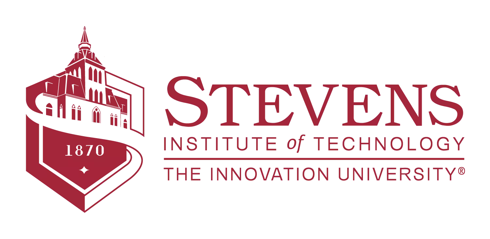

# Microprocessor Systems: CPE 390 
2021 Fall Stevens Institute of Technology

* **Meeting Times:** 		Tueday 2:30-3:20, Thursday at 2:30-4:20
* **Classroom Location:**	B123
* **Instructor:** 		Teaching Associate Prof. Dov Kruger
* **Contact Info:** 		Burchard Building 217, dkruger at stevens
* **Teaching Assistant:**       Fan Yang (fyang14 at stevens)
* **Office Hours:**		
  * Dov Kruger: online, Wedneday 11-12 Thursday 11-12, 8pm-9pm, in person by appt
  * Fan Yang:   Burchard Building 315, Mondays at 2.30pm-4.30pm and Wednesdays at 3.00pm-5.00pm

* **Course Web Address:**	https://github.com/stevensdeptece/CPE390

## COURSE DESCRIPTION

This course covers two aspects of how computers work.

First, how to write more efficient programs using a knowledge of how
computers owrk. We cover ARM assembler, optimization, and many aspects
of computers such as relative cost of different instructions, memory
characteristics, cache, MMU, block-oriented devices, and calls to the
OS to learn how to make computing faster. In addition, by learning the
way the machine works, students will also learn what can go wrong, including
overflow, roundoff errors, and segfaults.

In the hardware component, students learn how to interface the computer,
using an ARM-based Arduino microcontroller to control external devices and to measure external voltages.

Throughout the course, emphasis is on preparing students to read
documentation and learn indivdually. As a side effect of working on
Raspberry Pi students are expected to learn Unix command-line, gcc
toolchain, and git though this is not a tested outcome of the course.

## STUDENT LEARNING OUTCOMES
After successful completion of this course, students will be able to
*	write efficient programs in C/C++ on a low level
*	write ARM assembler programs to implement functions that are faster than C++ in limited instances
*	analyze and debug programs including reverse engineering code without source code availability
*	Build Circuits to interface to microcontrollers
*	Draw CAD diagrams of circuits
*	Test circuits in the lab using oscilloscopes and other equipment

## FORMAT AND STRUCTURE
*	Classes always involve live coding. Students are expected to participate and bring laptops to class, and take turns interacting on the screen with the instructor.
*	There will be weekly coding homework or handwritten assignments as well as a weekly lab.
*	Quizzes and tests on paper verify that the work presented as homework is actually your own.

## COURSE MATERIALS
* Textbook(s): 		none. Notes provided.
* Other Readings: 	Papers available in papers directory

## COURSE REQUIREMENTS
* **Attendance:**	Attendance is crucial for an effective learning but will not be graded. 
* **Homework:** 	Coding assignments will be submitted via canvas for individual single files, or via github.
* **Project:**		Depending on the semester, a final project may be substituted for the final.
* **Exams:** 	 	There will be two exams and a final.

## GRADING PROCEDURES
Grades will be based on:
* Programming Assignments             (5 %)
* Homework Assignments	              (5 %)
* Quizzes		              (10 %)
* Exams		              	      (80 %)

Late Policy: Assignments submitted after the deadline will not be graded.

## IMPORTANT DATES
* Deadline for Project Proposals **11/01/2019 Friday at 5pm ET**
  - This includes creation of a github repository with READ.md file that contains the summary of the project.
  - Late submissions or repositories with empty READ.md file will lose 30 points from their grade for the project.
* Deadline for Projects **12/02/2019 Monday at 5pm ET**
  - Projects will be graded based on
    - organization of the github repository     (30 %)
    - organization of the code                  (20 %)
    - the quality of the code                   (20 %)
    - inclusion of test codes                   (20 %)
    - reproducibility                           (10 %)
* Final exam date: **12/12/2019 Thursday at 6.30pm in BC 319 **

## ACADEMIC INTEGRITY 

### Undergraduates are subject to the honor board but professors may suggest punishment
My standard policy is that any cheating detected results in a zero for the entire assignment. In the case of a major test, this may mean that cheating makes it mathematically impossible to pass the class.

### Learning for Mastery
All students are expected to try to master the material. In an attempt to reduce stress and increase learning, retests are available.

Continued retests are subject to time constraints, and to the
instructor's opinion as to whether a given student is making
sufficient effort to warrant the extra chances.  All students are
expected to try hard on the first test, despite knowing that a retest
is available.

## EXAM ROOM CONDITIONS
The following procedures apply to quizzes and exams for this course. As the instructor, I reserve the right to modify any conditions set forth below by printing revised Exam Room Conditions on the quiz or exam. 

1.	Students are not permitted to use any electronic devices or text books during quizzes and/or exams. 

2.	Students are/are not allowed to work with or talk to other students during quizzes and/or exams.

## LEARNING ACCOMODATIONS

It is the policy of this instructor to require all students entitled
to learning accommodations to take a first test in regular time.
Students are expected to use this to learn how the tests are
conducted, to identify their weaknesses in knowledge are so they can
improve their performance.  Note that these assessments are designed
with far more than enough time.  The difficulty is when students do
not really know the material, which is why this course allows
restesting.

Students entitled to extra time may have that time when retesting if
they need it.

Note that this policy is in accordance with the law. You are entitled
to extra time, but even if it is stressful, I am entitled to ask you
to take the first test in regular time provided I give you the
opportunity to retest with have extra time.

If you have any questions about the
legality, please contact Phillip Gehman, the Director of Disability
Services Coordinator at Stevens Institute of Technology at
pgehman@stevens.edu or by phone (201) 216-3748.

## INCLUSIVITY 
### Name and Pronoun Usage 
As this course includes group work and in-class discussion, it is vitally important for us to create an educational environment of inclusion and mutual respect. This includes the ability for all students to have their chosen gender pronoun(s) and chosen name affirmed. If the class roster does not align with your name and/or pronouns, please inform the instructor of the necessary changes.

### Inclusion Statement
Stevens Institute of Technology believes that diversity and inclusiveness are essential to excellence in academic discourse and innovation. In this class, the perspective of people of all races, ethnicities, gender expressions and gender identities, religions, sexual orientations, disabilities, socioeconomic backgrounds, and nationalities will be respected and viewed as a resource and benefit throughout the semester. Suggestions to further diversify class materials and assignments are encouraged. If any course meetings conflict with your religious events, please do not hesitate to reach out to your instructor to make alternative arrangements.

You are expected to treat your instructor and all other participants in the course with courtesy and respect. Disrespectful conduct and harassing statements will not be tolerated and may result in disciplinary actions.

## MENTAL HEALTH RESOURCES
 Part of being successful in the classroom involves a focus on your whole self, including your mental health.  While you are at Stevens, there are many resources to promote and support mental health.  The Office of Counseling and Psychological Services (CAPS) offers free and confidential services to all enrolled students who are struggling to cope with personal issues (e.g., difficulty adjusting to college or trouble managing stress) or psychological difficulties (e.g., anxiety and depression).  Appointments are strongly encouraged and can be made by phone (201-216-5177) or in-person (on the 7th floor of the Howe Center). CAPS is open from 9:00 am – 5:00 pm Mondays, Wednesdays, Thursdays and Fridays and from 9:00 am – 7:00 pm on Tuesdays during the Fall and Spring semesters.
 
EMERGENCY INFORMATION
In the event of an urgent or emergent concern about the safety of yourself or someone else in the Stevens community, please immediately call the Stevens Campus Police at 201-216-5105 or on their emergency line at 201-216-3911.  These phone lines are staffed 24/7, year round.  Other 24/7 resources for students dealing with mental health crises include the National Suicide Prevention Lifeline (1-800-273-8255) and the Crisis Text Line (text “Home” to 741-741). If you are concerned about the wellbeing of another Stevens student, and the matter is not urgent or time sensitive, please email the CARE Team at care@stevens.edu. A member of the CARE Team will respond to your concern as soon as possible.  
